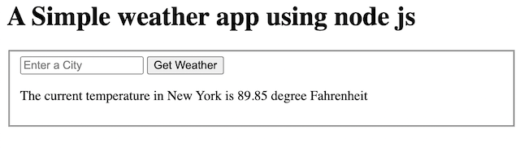

# Weather app

> This app is build with node.js

## Quick Guide

First get api key from [OpenWeatherMap](https://openweathermap.org/)

Later, clone this project

```bash
git clone https://github.com/priyaraj7/nodeJS-weather-app.git
```

move inside the directory

```bash
cd nodeJS-weather-app
```

install dependencies and start the app

```bash
npm install
npm start
```

Create a `.env` file and enter your api-key. You can refer `.env-example` file

Navigate to `http://localhost:5000/` and enter the city name. You will get the one day weather forecast of the given city



Note:
Server runs on http://localhost:5000
